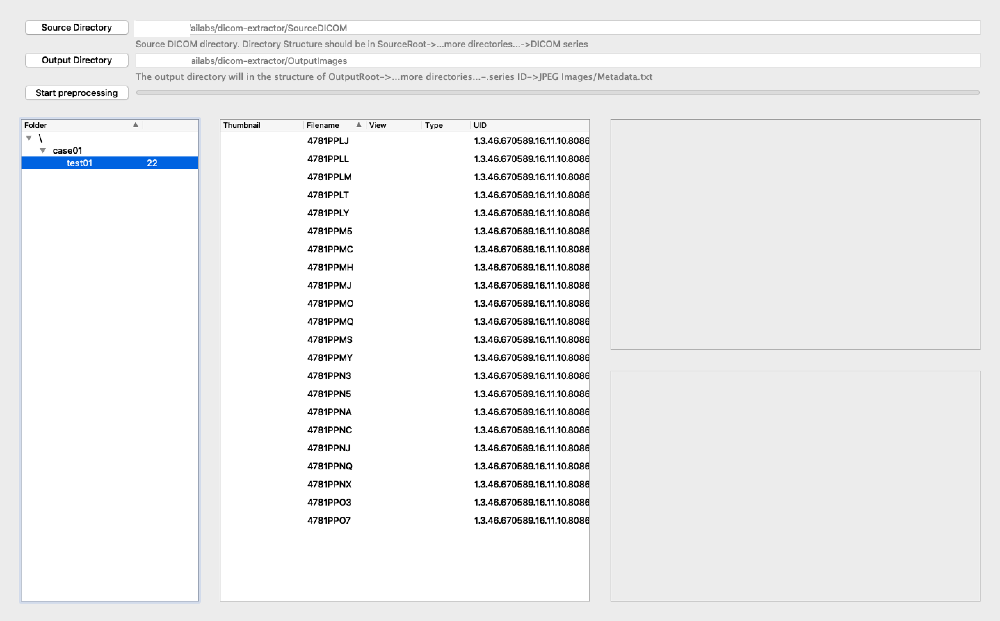
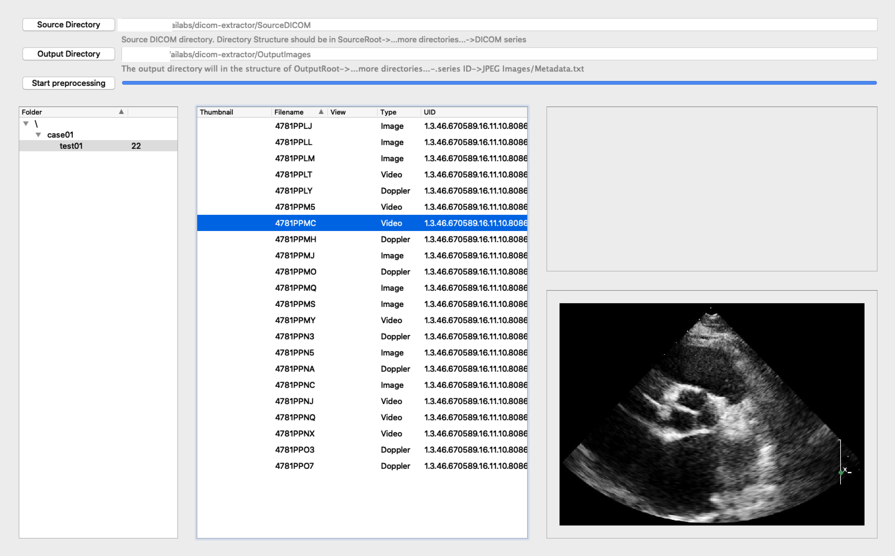
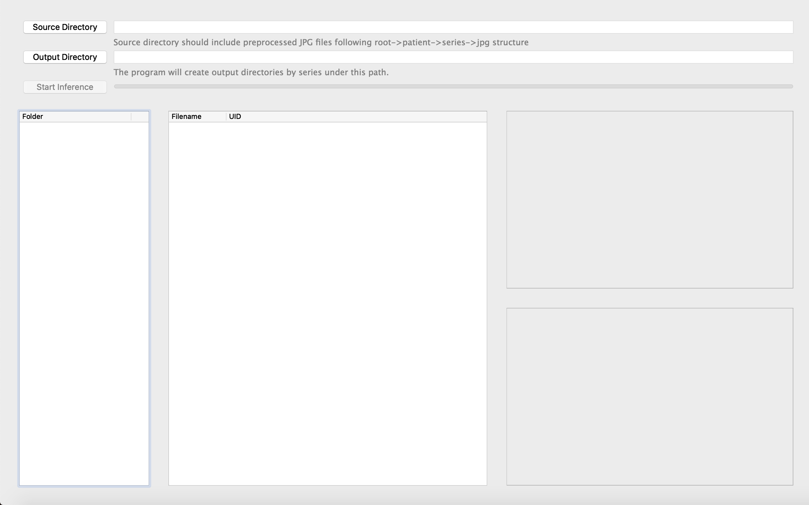
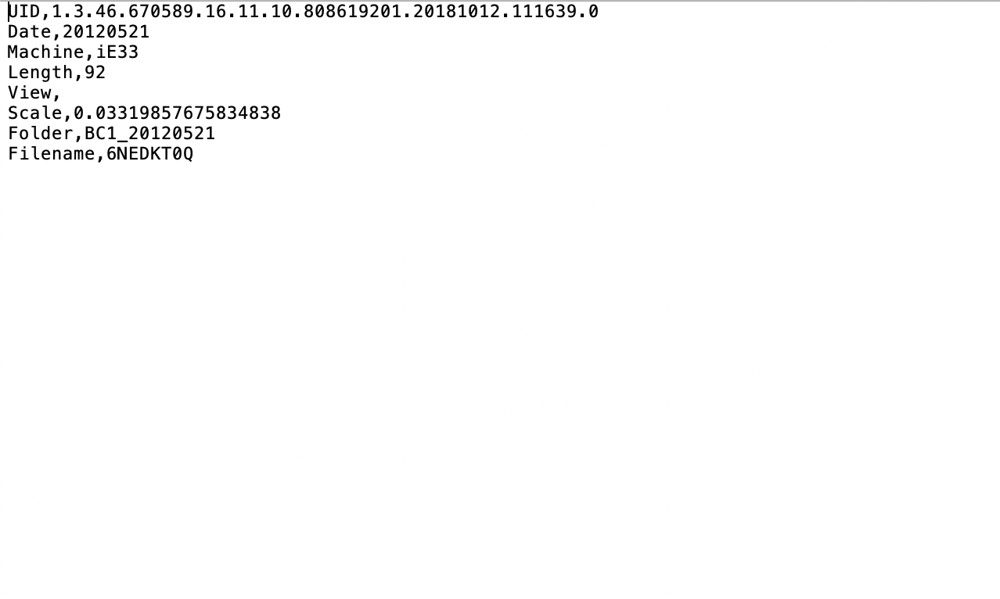
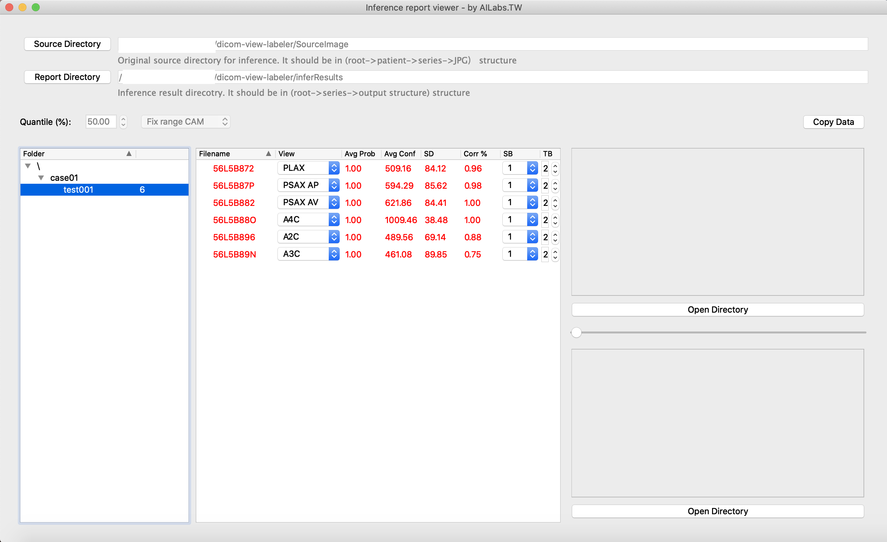
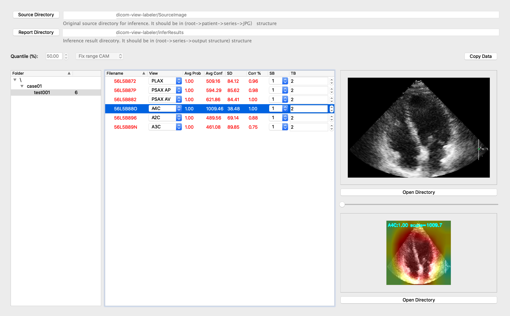

# EchocardiographyQC
Echocardiography Quality Control Utilities

## Introduction

This repository contains three **Microsoft WINDOWS** executable for echocardiography quality control.
1. `dicom-preprocess-1.0.0.exe`: Preprocessing tool that takes in DICOMs and outputs JPEG Images and Metadata for `dicom-inferrer-1.0.0.exe`
2. `dicom-inferrer-1.0.0.exe`: Inference tool that takes in echocardiography and outputs corresponding quality information.
3. `report-viewer-1.0.0.exe`: Viewer tool that takes in the output of inference tool for better analysis.

## Preprocessing tool

The preprocessing tool, `dicom-preprocess-1.0.0.exe` is an executable with graphical user interface for extracting DICOM into JPEG images for the inference tool in next step. This tool reads DICOM, masks images, and crops the central region. This tool accepts echocardiography DICOM from four different machines.

1. Philips CX50
2. Philips EPIQ7C
3. Philips iE33
4. HP SONOS

### Usage
First select the source directory and output directory, and then click the Start Preprocessing button. **Your directory structures should be as same as `SourceDICOM`**. The tool will only extract DICOM **videos** and output JPEG images and metadata. **Output directory structures will be similar to `SourceImages`**.

### Result
After the progress bar is full of color, you'll see the extracted images (Only for **video** types).

## Inference Tool

The inference tool, `dicom-inferrer-1.0.0.exe`, is an executable with graphical user interface for simple quality inference usage.

### Usage
First select the source directory and output directory, and then click the Start Inference button.

Wait until the progress bar is full of color.

**Since the executable only supports CPU inference, it might take a long time if you select all cases for inference. 
We suggest you to select a single case for inference if you're testing this tool**

### Input

The source directory should be organized in the following structure (`...prefix/patient/series/JPGFiles`, see `SourceImages` as an example). Any directory above `case01`(included) level in the following figures is acceptable. (or you could directly select the output directory from previous `dicom-preprocessing-1.0.0.exe` as the input of this tool.)

Inside the series folder, preprocessed images (with .jpg format) from DICOM and metadata text file are required.

The preprocessing steps are 
1. Crop the central region of images such that only sector area remains.
2. Mask the cropped image such that only sector area is viewable.

These steps should be easily done with the preprocessing tool that we provided above.

The `metadata.txt` file includes

### Output

The tool would output each series result as a subfolder in output directory named after series ID in input `metadata.txt`.
For each series, CAM results are provided, and the result has been normalized to (-25, 25).

Also, a `conf.npy` stores the quality information.

 

## Viewer Tool
The viewer tool, `report-viewer-1.0.0.exe`, is a executable with graphical user interface for viewing inference result.

### Usage
Select the source directory and the report directory, which should be as same as those of Inference tool, respectively.

#### View stats and inference images of patients

After navigating to the patient in the left region, the central region will show each series inference result for this patient.
Each column (from left to right) represents:

1. `Filename`: Filename of the series, which is read from `metadata.txt`
2. `View`: Predicted view of the cardiography. The tool shows the predicted view by default, which would be in red color. 
Other view's quality confidence and prediction confidence can be seen by dragging the list.
3. `Avg Prob`: Average prediction probability of the view. This number is averaged over the selected cycles(SB column).
4. `Avg Conf`: Average **quality confidence** of the view. This number is averaged over the selected cycles(SB column).
5. `SD`: Standard Deviation of **quality confidence** of the view. 
The nth quantile could be adjusted through the text box above the left region.
5. `Corr %`: The correct percentage of the DICOM video. This value is calculated by correct view prediction frames / total frames.
6. `SB`: Select which cardiography cycles to be viewed.
7. `TB`: Select total cardiography cycles to be viewed.

In the right region, the upper block show the original images and the lower block show the inference images. 

